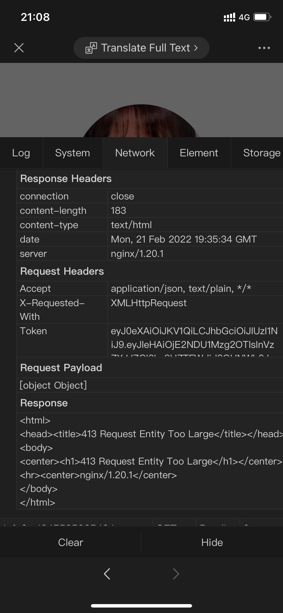

### 状态码413问题

#### 场景
- 移动端本地上传文件，正常
- 部署到线上出现413，请求内容太大



#### 分析及解决

#### 解决方法
这个问题既然是nginx配置的问题，那么常规的nginx配置中，需要在nginx.conf中增加配置项：

```editorconfig

user  nginx;
worker_processes  auto;

error_log  /var/log/nginx/error.log notice;
pid        /var/run/nginx.pid;


events {
    worker_connections  1024;
}


http {
    include       /etc/nginx/mime.types;
    default_type  application/octet-stream;

    log_format  main  '$remote_addr - $remote_user [$time_local] "$request" '
                      '$status $body_bytes_sent "$http_referer" '
                      '"$http_user_agent" "$http_x_forwarded_for"';

    access_log  /var/log/nginx/access.log  main;
    
    # 客户端最大body大小，如果4M还是会报413的话，就把数字改大                                                             
	  client_max_body_size 4M;

    sendfile        on;
    #tcp_nopush     on;

    keepalive_timeout  65;

    #gzip  on;

    include /etc/nginx/conf.d/*.conf;
}
```

