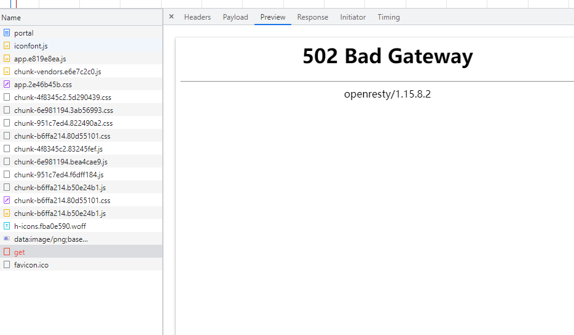
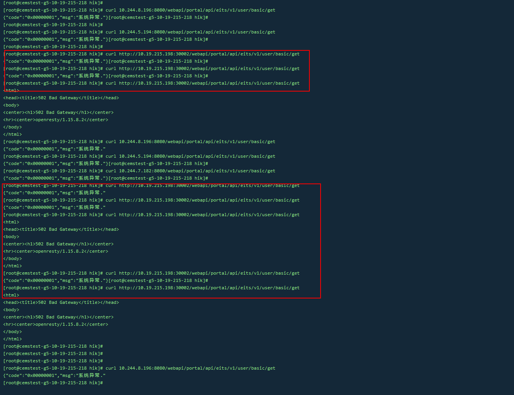
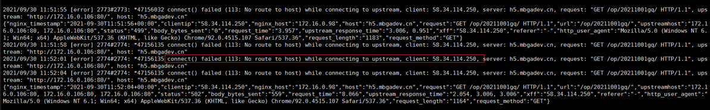
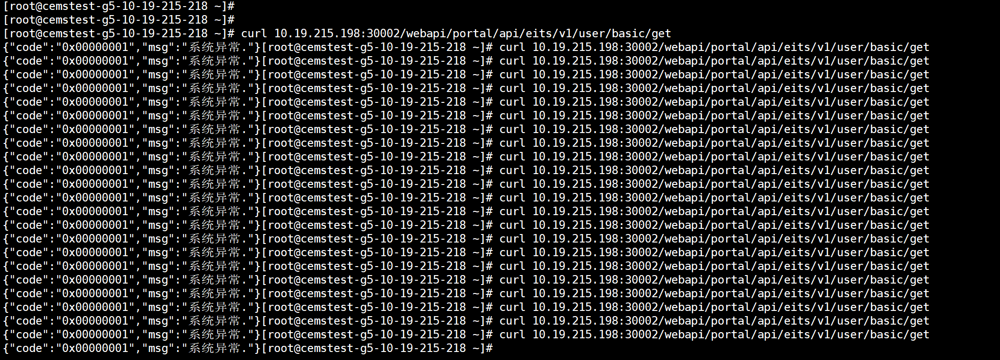

### 诡异的502

##### 现象
当接口请求响应返回`502 Bad Gateway`时，后续几分钟的任意请求均是502，包括前端静态资源的请求。

- 接口请求返回502

- 浏览器静态资源请求，同样返回502，仔细观察502的报错信息，其实是来自于后端的报错，造成了阻塞

  

##### 问题排查

当前集群环境，一个后端服务均对应三个pod，所有的服务通过`nginx-ingress`对外暴露服务，首先确认在集群内部是否可以正常访问到服务。

`kubectl describe ingress 具体ingress`，查询到访问的服务内部ip

通过`curl`对比后发现，集群内ip访问均正常，但是通过真实ip访问偶尔会出现`502 Bad Gateway`的问题，首先猜测是ingress出了问题

`kubectl get pod -n kube-system | grep ingress`查询到ingress的pod实例，然后打印日志`kubectl logs pod/pod实例`，检查日志

日志中出现error: `no route to host`，连接失败，这种情况下，多半就是pod出现异常了，先删除pod，重新构建pod后再尝试真实ip的访问

可以正常访问了！！（忽略接口报错）

当然如果pod重新构建之后，还是有问题的话，就得查看nginx的日志了。。。可怕的工程！！！

#### 总结

现在看来整个排查过程很顺利，其实不然，毕竟是个门外汉，先是查系统日志，然后找`kubelet`的日志，各种怀疑猜测，就是没有怀疑`nginx-ingress`的问题，还是找了大佬帮忙解决的，哎，道路艰辛，任重而道远，先整理一下思路，下次遇到了再深究吧。

