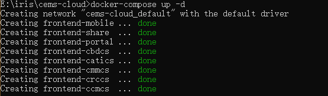
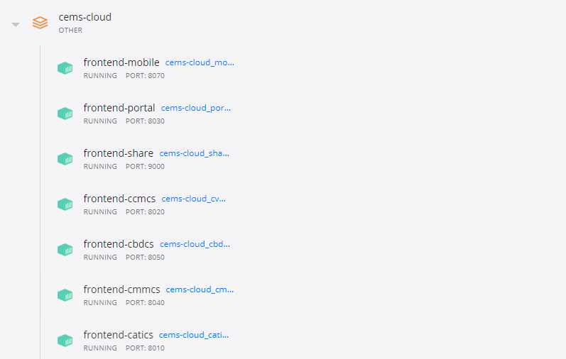
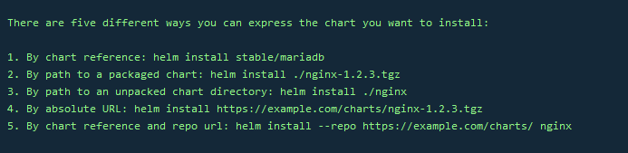
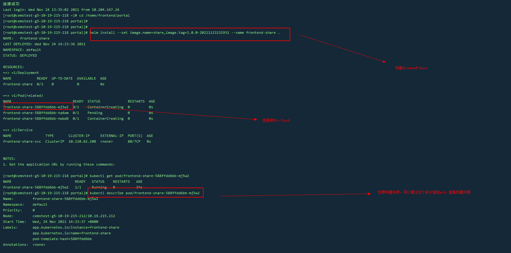
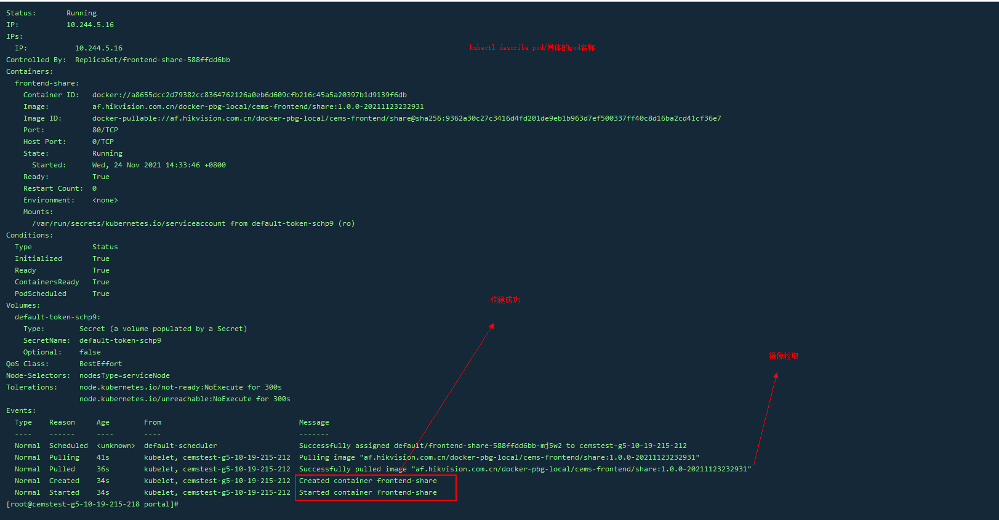
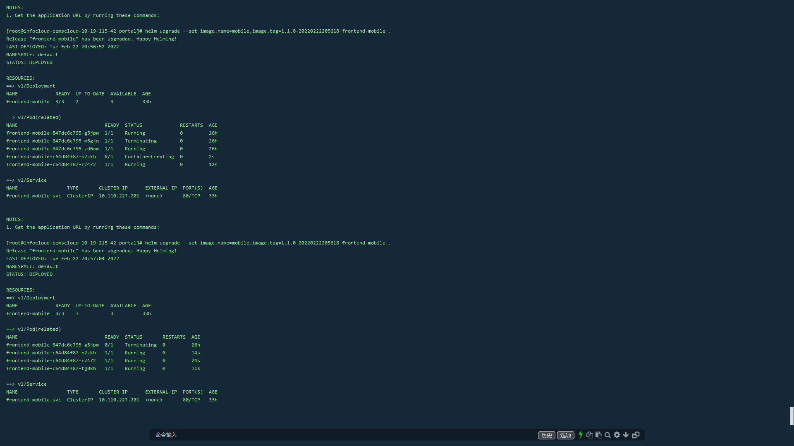
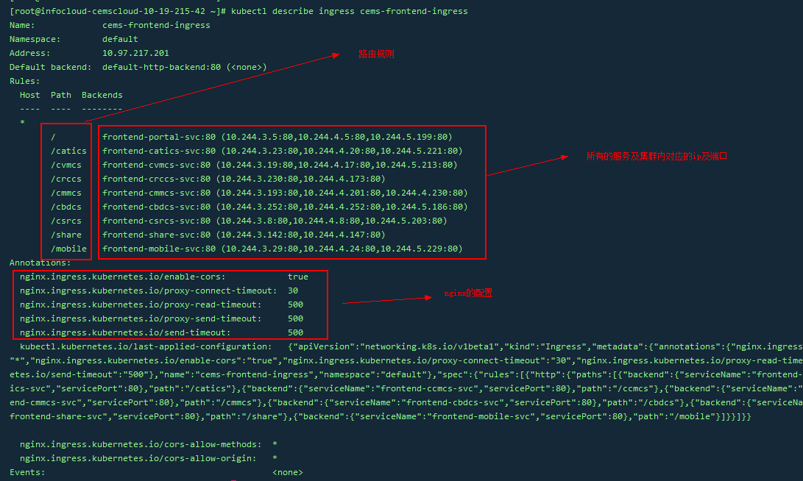
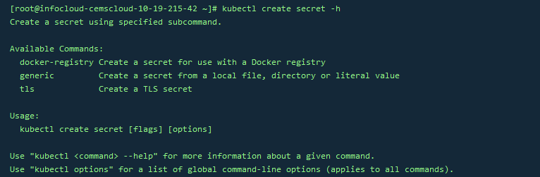

# 微前端服务在k8s中的部署总结


### 序言

本文主要从`docker`镜像的打包上传开始、`chart`编写到及`chart`安装、删除、更新及其他配置的编写及安装使用等。主要涉及有`docker`，`kubernetes`（简称`k8s`）及其工具`kubectl`、`helm`。

### 镜像打包及上传

镜像打包使用的是`docker`，这部分最重要的就是`Dockerfile`文件的编写，需要熟悉`Dockerfile`指令，包括但不限于`FROM`、`RUN`、`COPY`、`ADD`、`CMD`等，由于是手动部署，所以`Dockerfile`文件编写的很简单，只需要把前端事先构建好的文件都复制到镜像中即可。如下：

```
# 基于nginx:1.21.1-alpine镜像构建的基础镜像，因为alpine版本的镜像是轻量发行版，功能足够满足生产需求，最终打包后的基础镜像大小是9.47M
FROM **/frontend/base:latest

# 在Dockerfile文件的同级下的dist文件夹，复制到基础镜像中的/usr/share/nginx/html/
COPY dist /usr/share/nginx/html/
# 复制nginx配置，由于有多个前端项目，所以对应的nginx配置多少都会有点差异
COPY nginx.conf /etc/nginx/nginx.conf
# 运行nginx
CMD nginx -g "daemon off;"
```

虽然`docker build`可以进行镜像打包，但如果在微前端中，有多个前端服务`docker build`的效率就比较低，所以这里使用`Docker Compose`管理容器，更高效的对打包的镜像进行测试，当然相应的也需要一个配置文件：

```
# docker-compose.yaml
version: '3.7'
services: 
  share: # 服务名，打包时需要指定
  	# 容器名称
    container_name: frontend-share
    build:
      # 镜像打包工作上下文，即打包路径
      context: ./share
      # 基于上下文的dockerfile路径
      dockerfile: docker/Dockerfile
    ports:
      # 端口映射 镜像暴露端口:容器对外端口
      # nginx默认暴露80的端口，除非指定
      - 9000:9000
  cmmcs:
    container_name: frontend-cmmcs
    build:
      context: ./cmmcs
      dockerfile: Dockerfile
    ports:
      - 80:8040
    depends_on:
 	  # 依赖容器，如果运行时，依赖容器不存在，会报错
      - share
  cbdcs:
    container_name: frontend-cbdcs
    build:
      context: ./cbdcs
      dockerfile: Dockerfile
    ports:
      - 80:8050
    depends_on:
      - share
...(省略)
```

`docker-compose up -d`启动并运行容器，在`docker`面板中就会看到运行后的效果，所有的服务都分在一个组：





以下是在`docker-compose`的基础上，打包及上传镜像的命令：

```
# 登录远程仓库，只需登录一次，后续上传不需要再登录
docker login [远程仓库(域名或者ip)]

# 镜像打包
docker-compose build --no-cache [服务名]

# 镜像标签，由于需要上传到远程，所以需要指定版本号及时间戳，方便管理
docker tag [本地镜像名] [远程仓库/目录:版本号-时间戳]

# 上传到远程仓库
docker push [远程仓库/目录:版本号-时间戳]

# 重复操作，为简化日常维护，可编写一个脚本！！！！
```


### chart文件的编写

`chart`文件主要用于`k8s`构建中需要用到的配置，相当重要！！！创建`chart`就需要`k8s`中最为强大的`helm`，类似前端中使用的`npm`包管理工具。

首先，先找个合适的地方初始化一个`chart`：

```
helm init [FLAGS]
```

会在当前的目录下生成一个目录，内容大致如下：

```
frontend
├── Chart.yaml
├── templates # chart 配置模板，用于渲染最终的 Kubernetes YAML 文件
│   ├── NOTES.txt # 用户运行 helm install 时候的提示信息
│   ├── _helpers.tpl # 用于创建模板时的帮助类
│   ├── deployment.yaml # Kubernetes deployment 配置
│   ├── service.yaml # Kubernetes service 配置
│   └── tests
│       └── test-connection.yaml
└── values.yaml # 定义 chart 模板中的自定义配置的默认值，可以在执行 helm install 或 helm update 的时候覆盖
```

配置文件是用`yaml`编写，主要需要更改的配置有`values.yaml`、`deployment.yaml`、`service.yaml`，这三个文件分别用于定义的配置项、pod配置、服务配置，除了特别的配置外，基本上也是大同小异，所以在多个前端服务中，我们只需要写**一套chart**，在`install`或者`upgrade`的时候，修改一些参数就可以部署不同的服务了。

贴出部分配置：

```
# values.yaml
replicaCount: 3 # pod实例数

name: frontent-portal # 都是在name的基础上对pod和svc名称做的处理
namespace: default # 命名空间，如果不指定，则默认是default

image: # 镜像信息
  repository: **/sth-frontend
  name: portal
  tag: 1.0.0-20210918141745
  pullPolicy: IfNotPresent # 镜像拉取时机，IfNotPresent意思是，如果镜像不存在则拉取

service:
  type: ClusterIP # 服务类型，因为使用了ingress，所以不需要对外暴露端口，使用最基础的类型集群内访问即可
  port: 80 # 服务对集群内暴露的端口
  
needConfigMap: false # 是否需要configmap
nodeSelector: # 节点选择器，匹配上还能访问
  nodesType: serviceNode


# deployment.yaml
apiVersion: apps/v1
kind: Deployment
metadata:
  name: {{ .Release.Name }}
  namespace: {{ .Values.namespace }}
        ...(省略)
spec:
  replicas: {{ .Values.replicaCount }}
        ...(省略)
  template:
        ...(省略)
    spec:
      restartPolicy: Always
      containers:
        - name: {{ .Release.Name }}
          image: "{{ .Values.image.repository }}/{{ .Values.image.name }}:{{ .Values.image.tag }}" # 镜像地址
          imagePullPolicy: {{ .Values.image.pullPolicy }} # 镜像拉取时机
          ports:
            - name: http
              containerPort: {{ .Values.service.port }}
              protocol: TCP
        {{- if .Values.needConfigMap }}
          volumeMounts: # 是否需要configmap
            - mountPath: {{ .Values.mountPath }}
              name: {{ .Values.configMapName }}
              readOnly: true
        {{- end }}
        ...(省略)
      {{- with .Values.nodeSelector }}
      nodeSelector: # 节点选择器
        {{- toYaml . | nindent 8 }}
      {{- end }}
        ...(省略)
    {{- if .Values.needConfigMap }}
      volumes: # 数据卷配置
      - name: {{ .Values.configMapName }}
        configMap:
          name: {{ .Values.configMapName }}
    {{- end }}


# service.yaml
apiVersion: v1
kind: Service
metadata:
  name: "{{ .Release.Name }}-svc" # 服务名
  namespace: {{ .Values.namespace }} # 命名空间
        ...(省略)
spec:
  type: {{ .Values.service.type }} # 服务类型
  ports:
    - port: {{ .Values.service.port }} # 暴露端口
      targetPort: http
      protocol: TCP
      name: http
  ...(省略)

```


### chart包安装、删除及更新

`chart`的各种操作，自然也是用包管理工具`helm`来完成了。

#### 首次安装

需要跑一次`helm install [CHART] [flags]` ，我们先看一下`[CHART]` ：`chart`包可以是一个绝对路径/相对路径，甚至一个远程地址，也可以是打包好的`.tgz`文件，亦可以是一个解压后的文件夹，下面是官方对`chart`的说明：



由于微服务中会有多个服务，所以`[flags]`需要使用`--set` 重置`values.yaml`中的配置项，以及`--name`指定名称，比如：

```
helm install --set image=sth,tag=1.0.0-20220222222222 --name frontend-sth /home/frontend
```

运行后，控制台会打印一些信息，包括`pod`的名称/状态，服务的名称/类型以及集群分配的`ip`及端口：



如果还想查看更加详细的信息，可以使用`kubectl describe pod [pod名称]`，如果构建失败，则会在最后面的Events里列出因为什么原因导致构建失败，再对应着改就完事了。



#### 卸载

删除包就很简单了，直接用`helm delete --purge`，注意`--purge`，只有从内存中释放出来，才能再次安装同名的包。

#### 更新

更新与安装雷同，`helm upgrade [RELEASE] [CHART] [flags]`，需要指定更新的包名，其余与安装一样，比如：

```
helm upgrade --set image=sth,tag=1.0.0-20220222222222 frontend-sth /home/frontend
```

运行后，控制台打印信息与安装类似，但是仔细对比查看，可以发现`pod`数量比安装时多了一些，而且`STATUS`列都不一样，因为`upgrade`是逐步更新替换，更新的同时会保证服务正常的运行，做到无感更新，所以状态会有一些变化，直到新`pod`创建完成并运行后，原来的`pod`才会被删除；同时`service`的`ip`及端口都没变化，也说明`upgrade`是无感更新。以下是连续两次运行更新命令后的对比：



### 其他配置

#### Ingress代理

所有的服务都已经构建好了，都可以通过集群分配的`ip`（假设所有的服务类型都是可以通过集群外访问的`NodePort`或者`LoadBalancer`）和端口进行访问，但是呢，如果我想访问其他的服务就需要手动修改浏览器中的端口，非常的不方便，所以这就是代理的作用了，对于用户来说，也是极为的不解，如果不处理，项目多半也就黄了。

`k8s`官方中推荐的方式是使用`Ingress`，只需要配置正确的路由规则，就可以从集群外访问到集群内的服务了，而且也兼具负载均衡的功能。如果想使用Ingress，那么需要在集群中部署`Ingress`控制器，一般来说，集群中也集成了，所以我们也就不操心部署的问题，直接干！

```
# ingress.yaml
apiVersion: networking.k8s.io/v1beta1
kind: Ingress
metadata:
  name: sth-ingress
  annotations:
    # 使用nginx
    kubernetes.io/ingress.class: nginx
    # 后面的配置都是nginx中需要特别修改的配置，如果不特殊说明，则使用默认配置
    nginx.ingress.kubernetes.io/proxy-connect-timeout: "30"
    nginx.ingress.kubernetes.io/proxy-send-timeout: "500"
    nginx.ingress.kubernetes.io/proxy-read-timeout: "500"
    nginx.ingress.kubernetes.io/send-timeout: "500"
    nginx.ingress.kubernetes.io/enable-cors: "true"
    nginx.ingress.kubernetes.io/cors-allow-methods: "*"
    nginx.ingress.kubernetes.io/cors-allow-origin: "*"
    # 配置证书后，nginx需要增加的配置
    ingress.kubernetes.io/proxy-body-size: "0"
    # 如果不需要强制http转https, 则把 true 改成 false
    ingress.kubernetes.io/ssl-redirect: "true"
    nginx.ingress.kubernetes.io/proxy-body-size: "0"
    # 如果不需要强制http转https, 则把 true 改成 false
    nginx.ingress.kubernetes.io/ssl-redirect: "true"
spec:
  # 证书配置
  tls:
    - hosts:
        - **.com # 域名需要改成实际域名
      secretName: sth-secret # 创建的secret名称，后续讲到如果创建Secret
  rules:
    - host: **.com # 域名需要改成实际域名
      http:
        paths:
          - path: / # 路由规则
            backend:
              serviceName: frontend-portal-svc # chart中对应的服务名
              servicePort: 80 # docker镜像暴露的端口
          - path: /catics
            backend:
              serviceName: frontend-catics-svc
              servicePort: 80
          - path: /cvmcs
            backend:
              serviceName: frontend-cvmcs-svc
              servicePort: 80
           ...(省略)   
```

写好`ingress`的配置文件，就需要安装了

```
kubectl apply -f ingress.yaml
```

安装完成！查看`ingress`实际配置`kubectl describe sth-ingress`运行后，可以看到所有的路由规则及对应的服务在集群中的`ip`等信息，如果`ip`没有匹配到，那么这个服务没有完全构建成功，赶紧排查一下吧！



如果想要改一下配置，可以通过`kubectl edit ingress sth-ingress`，操作与在`vim`编辑器一样，保存后等待几分钟就会生效。

#### TLS证书

证书配置比较简单，直接使用`Secret`保存证书，以证书的安全性。



```
# 创建成功后即生效
# 证书安装好之后，需要在ingress的配置文件中，进行映射及配置域名，这样就可以使用https了
kubectl create secret tls sth-secret --cert=/home/frontend/tls/**.pem --key=/home/frontend/tls/**.key
# 删除
kubectl delete secret sth-secret
```

#### configMap数据卷

如果需要访问文件，但是文件数量较少，不需要经常更新，而且不适合放到镜像中，这种情况下创建文件系统有点小题大作浪费资源，那么就可以选择使用`configMap`来存放文件。`configMap`的使用方法也很简单，与`Secret`操作几乎一样：

```
# kubectl create configmap NAME [--from-file=[key=]source] [--from-literal=key1=value1] [--dry-run] [options]
# 创建
kubectl create configmap **-cfm --from-file /home/frontend/**.txt

# 删除，用于微信网页授权文件更改
# 删除后重新创建，需要一定的时间才能生效
kubectl delete configmap **-cfm
```

### 最后

这篇总结其实有很多东西都略过了，没有写清楚，但是大体上部署中遇到的问题都总结的差不多了，这段时间越接触，越发现自己了解的还只是皮毛，遇到问题需要排查，有时候都不知道从哪里开始下手，需要求助专业的运维同学，所以继续学习吧！
