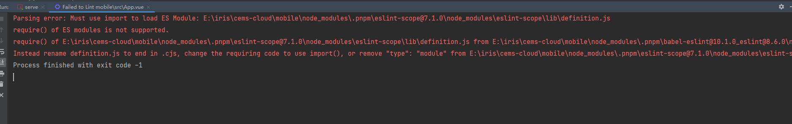

### Eslint Parsing Error

#### 解决方法

1、`babel-eslint`升级到`@babel/eslint-parser`
2、`.eslint.js`解析器由`parser: “babel-eslint”`改成`parse: "@babel/eslint-parser""`
3、`.eslint.js`解析器同级，新增`requireConfigFile: false"`
